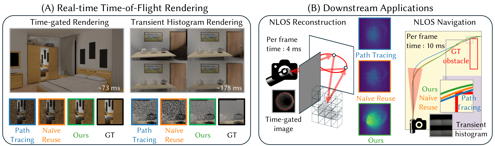

# FalcorComp

### [Project Page](https://juhyeonkim95.github.io/project-pages/tof_restir/) | [Paper (TBD)](https://juhyeonkim95.github.io/project-pages/tof_restir/) | [Tutorial (TBD)](https://juhyeonkim95.github.io/project-pages/tof_restir/)



This repository is the official Falcor implementation of **"ToF ReSTIR: Time-of-Flight Rendering with Spatio-temporal Reservoir Resampling"** by 
[Juhyeon Kim](https://juhyeonkim.netlify.app/), 
[Wojciech Jarosz](https://cs.dartmouth.edu/~wjarosz/), 
[Adithya Pediredla](https://sites.google.com/view/adithyapediredla/)
(SIGGRAPH 2026, journal paper).

---
## Compilation

Please refer to the original Falcor repository ([link](https://github.com/nvidiagameworks/falcor)) for build instructions. We have tested the code working on **Ubuntu 22.04.5 LTS**.


---

## Added Render Passes for ToF Rendering

We introduce several render passes for time-of-flight (ToF) rendering. Instead of using the default `PathTracer` in Falcor, we implement a custom path tracer using **inline ray tracing**, and build multiple ToF-specific variants on top of it.

## Time-Gated Image Rendering (H × W)

For time-gated rendering (each frame is an H × W image), we provide the following two render passes.

### MinimalTimeGatedPathTracer

A baseline time-gated renderer using naive path tracing.

**Parameters:**

- `computeDirect`: Include direct illumination
- `timeGateWindow`: Width of the time gate
- `timeMin`, `timeMax`: Simulation range for ToF
- `timeBin`: Number of simulation steps  
  *(Note: stepping interval may not match `timeGateWindow`)*
- `samplingMethod`: One of `direct`, `ellipsoidal` (Ellipsoidal connection from [Pediredla et al. 2019])
- `useEllipsoidalMIS`: Enable MIS for ellipsoidal connections

### MinimalTimeGatedReSTIR

Time-gated rendering using ReSTIR-based algorithm. (we skip the overlapping parameters)

**Additional Parameters:**

- `shiftmapMethod`: Path-length shift mapping method  
  (`no`, `local_tangent`, `barycentric`, `ray_trace`, `area_adaptive`)
- `gaugeAxis`: Axis used for Newton iteration
- `gaugeMode`: Gauge selection strategy  
  (`constant`, `grad`, `avg_grad`)
- `NewtonMaxIteration`: Maximum number of iterations
- `NewtonRelativeTolerance`: Convergence tolerance
- `timeGateWindowRough`: Coarse time gate (used for shrink mapping)
- `roughTimeGateSampleRatio`: Sampling ratio for coarse gate (used for shrink mapping)
- `temporalHistoryLength`: $M_{cap}$ in the ReSTIR paper
- `spatialReuseIteration`: Number of spatial reuse iterations
- `spatialReuseNeighborCount`: Number of neighbors
- `spatialReuseGatherRadius`: Neighborhood radius
- `useTemporalReuse`: Enable temporal reuse (disable for offline rendering)

## Transient Histogram Rendering (H × W × B)

For transient rendering (H x W x B histogram per frame), we provide two render passes.

Note that for each method, we scatter the sampled path's contribution into corresponding time bin (so called path reuse in [Jarabo et al. 2014]).

### TransientHistogramPathTracerInline

Naive path tracing with temporal binning. (we skip the overlapping parameters)

**Parameters:**

- `timeBin`: Number of temporal bins
- `samplingMethod`: One of `direct`, `tri_approx` ([Iseringhausen and Hullin 2020])
- `useKernelDensityEstimation`: Enable kernel density estimation proposed in [Jarabo et al. 2014]

### MinimalTransientReSTIR

ReSTIR-based transient rendering.

- Uses the same parameters as `MinimalTimeGatedReSTIR`

## Doppler Frequency Rendering (H × W)

We also support Doppler frequency rendering:

- `MinimalFrequencyGatedPathTracer`: Naive rendering
- `MinimalFrequencyGatedReSTIR`: ReSTIR-based rendering

All parameters are analogous to time-gated rendering, where time is interpreted as frequency.

---

## Usage

Below is an example of building a render graph for offline rendering with time-gated ReSTIR in Python:

```python
def build_tof_render_graph(testbed):
    render_graph = testbed.create_render_graph("PathTracer")

    # Create ToF ReSTIR pass
    render_graph.create_pass(
        "PathTracer", "MinimalTimeGatedReSTIR", 
        {
            "timeMin": 9.0,
            "timeMax": 12.0,
            "timeBin": 512,
            "timeGateWindow": 0.02,
            "laserCollocated": False,
            "isLightSourceLaser": True,
            "samplesPerPixel": 32,
            "shiftmapMethod": "area_adaptive",
            "gaugeMode": "avg_grad",
            "useTemporalReuse": False,
            "spatialReuseIteration": 3,
            "spatialReuseNeighborCount": 5,
            "spatialReuseGatherRadius": 10
        }
    )

    # Create V-buffer
    render_graph.create_pass(
        "VBufferRT", "VBufferRT",
        {'samplePattern': 'Center', 'sampleCount': 1, 'useAlphaTest': True}
    )

    # Laser V-buffer
    laser_position, laser_direction, laser_power = get_laser_info(scene_name)

    render_graph.create_pass(
        "LaserVBufferRT", "LaserVBufferRT",
        {
            'samplePattern': 'Center',
            'sampleCount': 1,
            'useAlphaTest': False,
            'laserPosition': laser_position.tolist(),
            'laserDirection': laser_direction.tolist(),
            'laserPower': laser_power.tolist(),
            'laserAngle': 0.0
        }
    )

    # Other render passes
    render_graph.create_pass("AccumulatePass", "AccumulatePass", {'enabled': True})
    render_graph.create_pass("ToneMapper", "ToneMapper", {'autoExposure': False})

    # Connect edges
    render_graph.add_edge("VBufferRT.vbuffer", "PathTracer.vbuffer")
    render_graph.add_edge("VBufferRT.viewW", "PathTracer.viewW")

    render_graph.add_edge("LaserVBufferRT.vbuffer", "PathTracer.laservbuffer")
    render_graph.add_edge("LaserVBufferRT.viewW", "PathTracer.laserviewW")

    render_graph.add_edge("PathTracer.color", "AccumulatePass.input")
    render_graph.add_edge("AccumulatePass.output", "ToneMapper.src")

    # Mark output
    render_graph.mark_output("AccumulatePass.output")

    return render_graph
```

---

## Tutorials
(TBA) We will add more tutorials later.

---
## References
- Pediredla et al., *Ellipsoidal Path Connections for Time-Gated Rendering*, SIGGRAPH 2019. https://dl.acm.org/doi/10.1145/3306346.3323016  
- Jarabo et al., *A Framework for Transient Rendering*, SIGGRAPH Asia 2014. https://studios.disneyresearch.com/wp-content/uploads/2019/03/A-Framework-for-Transient-Rendering.pdf  
- Iseringhausen and Hullin, *Non-line-of-sight Reconstruction Using Efficient Transient Rendering*, ACM TOG 2020. https://dl.acm.org/doi/10.1145/3368314

---
## Citation
If you find this useful for your research, please consider to cite:
```
@article{kim2026tof,
  title={ToF ReSTIR: Time-of-Flight Rendering with Spatio-temporal Reservoir Resampling},
  author={Kim, Juhyeon and Jarosz, Wojciech and Pediredla, Adithya},
  journal={ACM Transactions on Graphics (TOG)},
  volume={45},
  number={4},
  pages={1--18},
  year={2026},
  publisher={ACM New York, NY, USA}
}
```