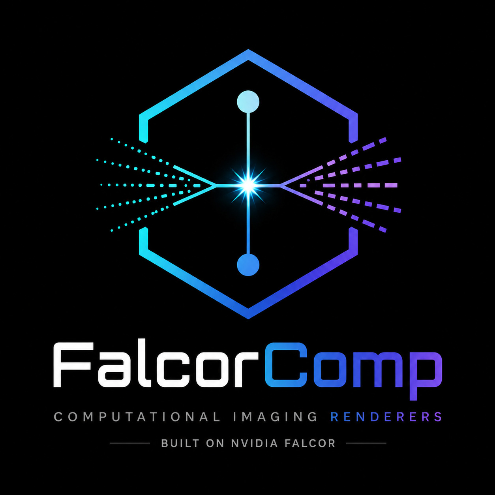

# FalcorComp

<p align="center">
  
</p>

<p align="center">
<b>Computational Imaging Renderers Built on <a href="https://github.com/NVIDIAGameWorks/Falcor">Falcor</a></b>
</p>

<div align="center">

| Documentation | PyPI | Build |
|:---:|:---:|:---:|
| [](https://falcorcomp.readthedocs.io/en/latest/) | [](https://test.pypi.org/project/falcorcomp/) | [](https://github.com/juhyeonkim95/FalcorComp/actions/workflows/build.yml) |

</div>


## Overview

FalcorComp is a collection of rendering algorithms for computational imaging built on top of <a href="https://github.com/NVIDIAGameWorks/Falcor">NVIDIA Falcor</a> renderer.

Rather than serving as a general-purpose rendering framework, this repository provides implementations of specialized Monte Carlo renderers developed for computational imaging research. The current focus is on active sensing modalities such as Time-of-Flight, event cameras, and structured light.

FalcorComp is **performance-oriented**: all renderers run on the GPU with hardware ray tracing, which enables **real-time, interactive simulation** as well as offline rendering.


## Implemented Renderers

- **Time-of-Flight rendering**
  - **Time-gated rendering** (H x W): an image of only the light whose total path length (laser -> scene -> camera) falls inside a time gate.
  - **Transient histogram rendering** (H x W x B): for every pixel, a histogram of how much light arrives at each path length, in B bins over a chosen path-length range.
- (TBD) Event camera
- (TBD) Structured light
- (TBD) Doppler rendering

## Related Works

FalcorComp includes implementations of the following papers:

- **"ToF ReSTIR: Time-of-Flight Rendering with Spatio-temporal Reservoir Resampling"**  
  **SIGGRAPH 2026 (ACM TOG)**  
  [[Project Page]](https://juhyeonkim95.github.io/project-pages/tof_restir/)
  
  Efficient transient Time-of-Flight rendering using ReSTIR-based path reuse.


- **"Difference-aware Filtering for Event Camera Simulation"**  
  **EGSR 2026 (Computer Graphics Forum)**  
  [[Project Page]](https://juhyeonkim95.github.io/project-pages/event_svgf/)

    Low-sample event camera rendering using correlated  sampling and difference-aware filtering.

- **"Geometric Antithetic Sampling for Spatiotemporally Modulated Light"**  
  **SIGGRAPH Asia 2026 (Conference)**  
  Project Page (TBD)

  Variance reduction for rendering spatiotemporally modulated light (CW-ToF, structured light) using geometric antithetic sampling.

For details, please refer to the corresponding project page for each paper.

## Installation

FalcorComp is installed as the Python package `falcorcomp`, which contains Falcor and the render passes, so no separate Falcor build is needed. It requires 64-bit Linux or Windows, an NVIDIA GPU with hardware ray tracing (RTX), and Python 3.9 to 3.13.

The package is currently published on TestPyPI:

```bash
pip install --index-url https://test.pypi.org/simple/ --extra-index-url https://pypi.org/simple/ falcorcomp
```

To check the installation (this also initializes the GPU):

```bash
python -c "import falcorcomp as falcor; falcor.Testbed(create_window=False); print('falcorcomp works')"
```

See the [installation guide](https://falcorcomp.readthedocs.io/en/latest/src/getting_started/installation.html) for details, troubleshooting, and building from source.


## Acknowledgments

FalcorComp is built upon the open-source rendering framework <a href="https://github.com/NVIDIAGameWorks/Falcor">NVIDIA Falcor</a>. We thank the NVIDIA Research team and Falcor contributors for making their rendering infrastructure publicly available.


## Citation

If you find FalcorComp useful in your research, please consider citing the corresponding paper(s):

```bibtex
% ToF ReSTIR
@article{kim2026tof,
  title={ToF ReSTIR: Time-of-Flight Rendering with Spatio-temporal Reservoir Resampling},
  author={Kim, Juhyeon and Jarosz, Wojciech and Pediredla, Adithya},
  journal={ACM Transactions on Graphics (TOG)},
  volume={45},
  number={4},
  pages={1--18},
  year={2026},
  publisher={ACM New York, NY, USA}
}

% Difference-aware Filtering for Event Camera Simulation
@inproceedings{kim2026difference,
  title={Difference-aware Filtering for Event Camera Simulation},
  author={Kim, Juhyeon and Jarosz, Wojciech and Pediredla, Adithya},
  booktitle={Computer graphics forum},
  volume={45},
  number={4},
  year={2026},
  organization={Eurographics/John Wiley \& Sons}
}

% Geometric Antithetic Sampling for Spatiotemporally Modulated Light
(TBD)
```
