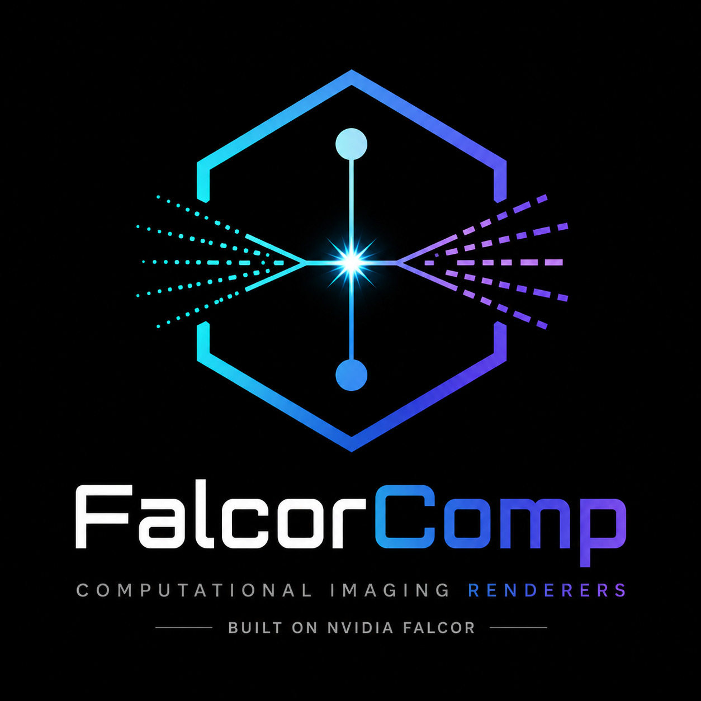
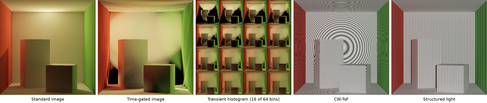

# FalcorComp

<p align="center">
  
</p>

<p align="center">
<b>Computational Imaging Renderers Built on <a href="https://github.com/NVIDIAGameWorks/Falcor">Falcor</a></b>
</p>

<div align="center">

| Documentation | PyPI | Build |
|:---:|:---:|:---:|
| [](https://falcorcomp.readthedocs.io/en/latest/) | [](https://test.pypi.org/project/falcorcomp/) | [](https://github.com/juhyeonkim95/FalcorComp/actions/workflows/build.yml) |

</div>


## Overview

FalcorComp is a collection of rendering algorithms for computational imaging built on top of <a href="https://github.com/NVIDIAGameWorks/Falcor">NVIDIA Falcor</a> renderer.

Rather than serving as a general-purpose rendering framework, this repository provides implementations of specialized Monte Carlo renderers developed for computational imaging research. The current focus is on active sensing modalities such as Time-of-Flight, structured light, Doppler sensing, and event cameras.

FalcorComp is **performance-oriented**: all renderers run on the GPU with hardware ray tracing, which enables **real-time, interactive simulation** as well as offline rendering.


## What It Renders

<p align="center">
  
</p>

The Cornell box rendered with FalcorComp. Left: a standard image. Top: a time-gated image, a transient histogram, and CW-ToF and structured-light measurements. Bottom, with the tall box approaching and the short box receding: a Doppler spectrum, a Doppler-gated image, the velocity from Doppler ToF measurements, and the events of a moving camera. Every measurement is a path integral with a weight on each light path; see [Measurements as path integrals](https://falcorcomp.readthedocs.io/en/latest/src/getting_started/measurements.html).

### Time-of-Flight

The measurement depends on the total length of each light path (laser → scene → camera), which sets its arrival time.

| Measurement | Output | Render passes |
|---|---|---|
| **Time-gated image** | `H × W`: the light whose path length falls inside a time gate | [`TimeGatedPathTracerInline`](https://falcorcomp.readthedocs.io/en/latest/src/plugin_reference/time_gated/TimeGatedPathTracerInline.html), [`TimeGatedReSTIRInline`](https://falcorcomp.readthedocs.io/en/latest/src/plugin_reference/time_gated/TimeGatedReSTIRInline.html) |
| **Transient histogram** | `H × W × B`: for every pixel, the light arriving at each path length, in `B` bins | [`TransientHistogramPathTracerInline`](https://falcorcomp.readthedocs.io/en/latest/src/plugin_reference/transient/TransientHistogramPathTracerInline.html), [`TransientHistogramReSTIRInline`](https://falcorcomp.readthedocs.io/en/latest/src/plugin_reference/transient/TransientHistogramReSTIRInline.html) |

### Modulated Light

The light varies in time or in space, and the measurement weights each path by that modulation.

| Measurement | Modulation | Render pass |
|---|---|---|
| **Continuous-wave ToF** | a periodic function of the path length | [`CWToFPathTracerInline`](https://falcorcomp.readthedocs.io/en/latest/src/plugin_reference/modulated/CWToFPathTracerInline.html) |
| **Structured light** | a projected pattern | [`StructuredLightPathTracerInline`](https://falcorcomp.readthedocs.io/en/latest/src/plugin_reference/modulated/StructuredLightPathTracerInline.html) |

### Doppler

The measurement depends on how fast each path's length changes as the scene moves (with FMCW, also on the length itself).

| Measurement | Output | Render pass |
|---|---|---|
| **Doppler-gated image (OHD)** | `H × W`: the light whose Doppler shift falls inside a gate | [`DopplerGatedPathTracerInline`](https://falcorcomp.readthedocs.io/en/latest/src/plugin_reference/doppler/DopplerGatedPathTracerInline.html) |
| **Doppler spectrum (OHD)** | `H × W × B`: for every pixel, the light at each Doppler shift, in `B` bins | [`DopplerHistogramPathTracerInline`](https://falcorcomp.readthedocs.io/en/latest/src/plugin_reference/doppler/DopplerHistogramPathTracerInline.html) |
| **FMCW spectra (OHD)** | `H × W × B`, for the up- and the down-chirp: the light at each beat frequency, which depends on the path length and the Doppler shift | [`DopplerHistogramPathTracerInline`](https://falcorcomp.readthedocs.io/en/latest/src/plugin_reference/doppler/DopplerHistogramPathTracerInline.html) with a chirp |
| **Doppler ToF** | `H × W`: a CW-ToF measurement with slightly different light and sensor frequencies, over an exposure in which the objects move | [`DopplerToFPathTracerInline`](https://falcorcomp.readthedocs.io/en/latest/src/plugin_reference/doppler/DopplerToFPathTracerInline.html) |

The [Doppler rendering tutorial](https://juhyeonkim95.github.io/project-pages/doppler_tutorial/) compares OHD and Doppler ToF side by side.

### Event Camera

Each pixel reports when its brightness log(I_ε + I) changes by more than a threshold.

| Measurement | Output | Render passes |
|---|---|---|
| **Brightness change and events** | `H × W` per frame: the change ΔL since the previous frame, and the signed number of events | [`EventDifference`](https://falcorcomp.readthedocs.io/en/latest/src/plugin_reference/event/EventDifference.html), [`EventSVGF`](https://falcorcomp.readthedocs.io/en/latest/src/plugin_reference/event/EventSVGF.html), [`EventGenerator`](https://falcorcomp.readthedocs.io/en/latest/src/plugin_reference/event/EventGenerator.html) |

## Related Works

FalcorComp includes implementations of the following papers:

- **"ToF ReSTIR: Time-of-Flight Rendering with Spatio-temporal Reservoir Resampling"**  
  **SIGGRAPH 2026 (ACM TOG)**  
  [[Project Page]](https://juhyeonkim95.github.io/project-pages/tof_restir/)
  
  Efficient transient Time-of-Flight rendering using ReSTIR-based path reuse.


- **"Difference-aware Filtering for Event Camera Simulation"**  
  **EGSR 2026 (Computer Graphics Forum)**  
  [[Project Page]](https://juhyeonkim95.github.io/project-pages/event_svgf/)

    Low-sample event camera rendering using correlated  sampling and difference-aware filtering.

- **"Geometric Antithetic Sampling for Spatiotemporally Modulated Light"**  
  **SIGGRAPH Asia 2026 (Conference)**  
  [[Project Page]](https://juhyeonkim95.github.io/project-pages/antithetic_modulation/)

  Variance reduction for rendering spatiotemporally modulated light (CW-ToF, structured light) using geometric antithetic sampling.

- **"A Monte Carlo Rendering Framework for Simulating Optical Heterodyne Detection"**  
  **SIGGRAPH 2025 (ACM TOG), Honorable Mention**  
  [[Project Page]](https://juhyeonkim95.github.io/project-pages/ohd_rendering/)

  Rendering the Doppler spectrum of optical heterodyne detection (coherent lidar) with the OHD path integral.

- **"Doppler Time-of-Flight Rendering"**  
  **SIGGRAPH Asia 2023 (ACM TOG)**  
  [[Project Page]](https://juhyeonkim95.github.io/project-pages/dopplertof/)

  Rendering Doppler time-of-flight cameras, whose heterodyne measurement reveals the velocity of moving objects.

For details, please refer to the corresponding project page for each paper.

## Installation

FalcorComp is installed as the Python package `falcorcomp`, which contains Falcor and the render passes, so no separate Falcor build is needed. It requires 64-bit Linux or Windows, an NVIDIA GPU with hardware ray tracing (RTX), and Python 3.9 to 3.13.

The package is currently published on TestPyPI:

```bash
pip install --index-url https://test.pypi.org/simple/ --extra-index-url https://pypi.org/simple/ falcorcomp
```

To check the installation (this also initializes the GPU):

```bash
python -c "import falcorcomp as falcor; falcor.Testbed(create_window=False); print('falcorcomp works')"
```

See the [installation guide](https://falcorcomp.readthedocs.io/en/latest/src/getting_started/installation.html) for details, troubleshooting, and building from source.


## Acknowledgments

FalcorComp is built upon the open-source rendering framework <a href="https://github.com/NVIDIAGameWorks/Falcor">NVIDIA Falcor</a>. We thank the NVIDIA Research team and Falcor contributors for making their rendering infrastructure publicly available.


## Citation

If you find FalcorComp useful in your research, please consider citing the corresponding paper(s):

```bibtex
% ToF ReSTIR
@article{kim2026tof,
  title={ToF ReSTIR: Time-of-Flight Rendering with Spatio-temporal Reservoir Resampling},
  author={Kim, Juhyeon and Jarosz, Wojciech and Pediredla, Adithya},
  journal={ACM Transactions on Graphics (TOG)},
  volume={45},
  number={4},
  pages={1--18},
  year={2026},
  publisher={ACM New York, NY, USA}
}

% Difference-aware Filtering for Event Camera Simulation
@inproceedings{kim2026difference,
  title={Difference-aware Filtering for Event Camera Simulation},
  author={Kim, Juhyeon and Jarosz, Wojciech and Pediredla, Adithya},
  booktitle={Computer graphics forum},
  volume={45},
  number={4},
  year={2026},
  organization={Eurographics/John Wiley \& Sons}
}

% Geometric Antithetic Sampling for Spatiotemporally Modulated Light
(TBD)

% A Monte Carlo Rendering Framework for Simulating Optical Heterodyne Detection
@article{kim2025ohd,
  author={Kim, Juhyeon and Benko, Craig and Wrenninge, Magnus and Villemin, Ryusuke and Barber, Zeb and Jarosz, Wojciech and Pediredla, Adithya},
  title={A Monte Carlo Rendering Framework for Simulating Optical Heterodyne Detection},
  journal={ACM Transactions on Graphics (TOG)},
  volume={44},
  number={4},
  articleno={56},
  numpages={19},
  year={2025},
  doi={10.1145/3731150},
  publisher={ACM New York, NY, USA}
}

% Doppler Time-of-Flight Rendering
@article{kim2023doppler,
  title={Doppler Time-of-Flight Rendering},
  author={Kim, Juhyeon and Jarosz, Wojciech and Gkioulekas, Ioannis and Pediredla, Adithya},
  journal={ACM Transactions on Graphics (TOG)},
  volume={42},
  number={6},
  pages={1--18},
  year={2023},
  publisher={ACM New York, NY, USA}
}
```
