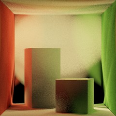
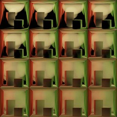
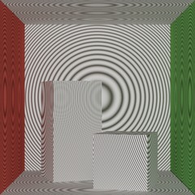
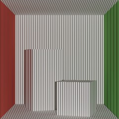
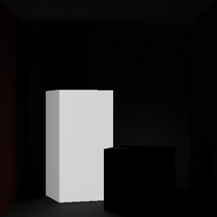
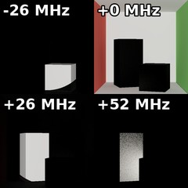
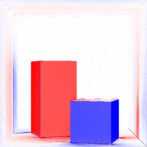
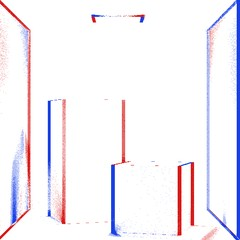

# Measurements as path integrals

Every measurement that falcorcomp renders is the path integral of a standard image with a weight on each light path.
The weight depends on a property of the path: its length (time of flight), how the light is modulated (CW-ToF,
structured light), or how fast its length changes (Doppler). Event cameras measure the change of an image between two
times.

## Notation

- $\bar{\mathbf{x}} = (x_0, \dots, x_k)$ is a light path from the light ($x_0$) to the camera ($x_k$); $\mathcal{P}$ is the space
  of all paths and $f(\bar{\mathbf{x}})$ the measurement contribution of a path, so that a standard path tracer estimates
  $\int_\mathcal{P} f(\bar{\mathbf{x}})\, \mathrm{d}\bar{\mathbf{x}}$.
- $\ell(\bar{\mathbf{x}}) = \sum_i \eta_i \lVert x_{i+1} - x_i \rVert$ is the optical path length ($\eta_i$: refractive index
  of segment $i$); the arrival time is $\ell / c$.
- $u(\bar{\mathbf{x}}) = \sum_i \eta_i\, (v_i - v_{i+1}) \cdot \hat{d}_i$ is the path velocity: the rate at which the path
  shortens, from the velocities $v_i$ of its vertices along each segment direction $\hat{d}_i$. A path with path
  velocity $u$ has the Doppler shift $f_D(\bar{\mathbf{x}}) = u(\bar{\mathbf{x}}) / \lambda$ at laser wavelength $\lambda$.
- $w_\tau(\ell) = \frac{1}{\Delta}\, g\!\left(\frac{\ell - \tau}{\Delta}\right)$ is a gate of width $\Delta$ at
  $\tau$, with a kernel $g$ (box, tent, Gaussian, ...; see [the kernels](#gate-kernels)). The $1/\Delta$ makes the
  result a density: radiance per unit path length, or per MHz for Doppler gates.

## Measurements

```{list-table}
:header-rows: 1
:widths: 34 66

* - Measurement
  - Path integral
* - **Standard image**

    
  - $$I = \int_\mathcal{P} f(\bar{\mathbf{x}})\, \mathrm{d}\bar{\mathbf{x}}$$
* - **Time-gated image**

    

    [`TimeGatedPathTracerInline`](../plugin_reference/time_gated/TimeGatedPathTracerInline.md), [`TimeGatedReSTIRInline`](../plugin_reference/time_gated/TimeGatedReSTIRInline.md)
  - $$I(\tau) = \int_\mathcal{P} f(\bar{\mathbf{x}})\, w_\tau\!\left(\ell(\bar{\mathbf{x}})\right) \mathrm{d}\bar{\mathbf{x}}$$

    The light whose path length falls in the gate at $\tau$.
* - **Transient histogram**

    

    [`TransientHistogramPathTracerInline`](../plugin_reference/transient/TransientHistogramPathTracerInline.md), [`TransientHistogramReSTIRInline`](../plugin_reference/transient/TransientHistogramReSTIRInline.md)
  - $$I(\tau_b) = \int_\mathcal{P} f(\bar{\mathbf{x}})\, w_{\tau_b}\!\left(\ell(\bar{\mathbf{x}})\right) \mathrm{d}\bar{\mathbf{x}}, \quad b = 1, \dots, B$$

    Time-gated images at $B$ gates at once: box gates that tile the range, one per bin.
* - **Continuous-wave ToF**

    

    [`CWToFPathTracerInline`](../plugin_reference/modulated/CWToFPathTracerInline.md)
  - $$I = \int_\mathcal{P} f(\bar{\mathbf{x}})\, m\!\left(\ell(\bar{\mathbf{x}})\right) \mathrm{d}\bar{\mathbf{x}}$$
    $$m(\ell) = g\!\left(\frac{\ell}{\lambda_m} - \phi\right)$$

    A periodic waveform $g$ of the path length, of modulation wavelength $\lambda_m$ and phase $\phi$.
* - **Structured light**

    

    [`StructuredLightPathTracerInline`](../plugin_reference/modulated/StructuredLightPathTracerInline.md)
  - $$I = \int_\mathcal{P} f(\bar{\mathbf{x}})\, P\!\left(\xi(\bar{\mathbf{x}})\right) \mathrm{d}\bar{\mathbf{x}}$$

    The projected pattern $P$ at the projector coordinates $\xi$ of the path's first vertex.
* - **Doppler-gated power spectral density** (OHD)

    

    [`DopplerGatedPathTracerInline`](../plugin_reference/doppler/DopplerGatedPathTracerInline.md)
  - $$S(\nu) = \int_\mathcal{P} f(\bar{\mathbf{x}})\, w_\nu\!\left(f_D(\bar{\mathbf{x}})\right) \mathrm{d}\bar{\mathbf{x}}$$

    The light whose Doppler shift falls in the gate at $\nu$: power per unit frequency, not intensity. Shown: the
    gate at +26 MHz, the tall box approaching.
* - **Doppler spectrum** (OHD)

    

    [`DopplerHistogramPathTracerInline`](../plugin_reference/doppler/DopplerHistogramPathTracerInline.md)
  - $$S(\nu_b) = \int_\mathcal{P} f(\bar{\mathbf{x}})\, w_{\nu_b}\!\left(f_D(\bar{\mathbf{x}})\right) \mathrm{d}\bar{\mathbf{x}}, \quad b = 1, \dots, B$$

    Doppler-gated spectra at $B$ frequencies at once. Shown: 4 of the bins.
* - **Doppler ToF**

    

    [`DopplerToFPathTracerInline`](../plugin_reference/doppler/DopplerToFPathTracerInline.md)
  - $$I = \frac{1}{T} \int_0^T \int_{\mathcal{P}} f(\bar{\mathbf{x}}, t)\, m\!\left(t, \ell(\bar{\mathbf{x}}, t)\right) \mathrm{d}\bar{\mathbf{x}}\, \mathrm{d}t$$
    $$m(t, \ell) = \cos\!\left(2\pi\left(\Delta f\, t - \frac{f_g\, \ell}{c} - \phi\right)\right)$$

    A double integral over paths and the exposure $[0, T)$: the scene moves, and the light, modulated at $f_g$, is
    mixed with a sensor modulated at $f_g - \Delta f$. Shown: the velocity from a heterodyne ($\Delta f = 1/T$)
    and a homodyne ($\Delta f = 0$) measurement (red: approaching, blue: receding).
* - **Event camera**

    

    [`EventDifference`](../plugin_reference/event/EventDifference.md), [`EventSVGF`](../plugin_reference/event/EventSVGF.md), [`EventGenerator`](../plugin_reference/event/EventGenerator.md)
  - $$\Delta I_t = \int_{\mathcal{P}_t} f_t(\bar{\mathbf{x}})\, \mathrm{d}\bar{\mathbf{x}} - \int_{\mathcal{P}_{t-1}} f_{t-1}(\bar{\mathbf{x}})\, \mathrm{d}\bar{\mathbf{x}}$$
    $$\Delta L_t = \log(I_\epsilon + I_t) - \log(I_\epsilon + I_{t-1})$$

    The change of a standard image between frames $t-1$ and $t$ at each pixel, and of its brightness $L$; an event
    fires each time $L$ changes by the threshold $C$. Correlated sampling estimates both integrals with the same
    random numbers. Shown: events over 8 frames (red: brighter, blue: darker).
```

## Correspondences

Time of flight and Doppler measurements have the same form, with the Doppler shift in place of the path length:

| Weight on the path's | Gated (one image) | Histogram ($B$ images) |
|---|---|---|
| path length $\ell(\bar{\mathbf{x}})$ | time-gated image $I(\tau)$ | transient histogram $I(\tau_b)$ |
| Doppler shift $f_D(\bar{\mathbf{x}})$ | Doppler-gated PSD $S(\nu)$ | Doppler spectrum $S(\nu_b)$ |

The gated passes use the same gate kernels, and a box gate one bin wide at the center of a bin gives that bin of the
histogram. The other measurements weight the path by a modulation instead of a gate: CW-ToF by a periodic function of
its length, Doppler ToF by one that also changes over the exposure, structured light by the projected pattern.

The images are the Cornell box, with the settings of the [overview](overview.md).
